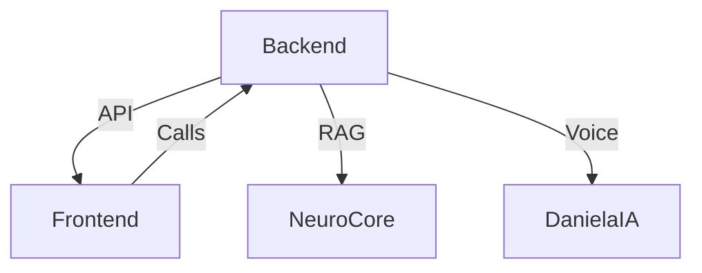

# 🌌 AIGestion Nexus | Sovereign Intelligence Platform

Arquitectura de inteligencia soberana de alto rendimiento, optimizada para orquestación de swarms, RAG y agentes autónomos.

## 🏗️ Estructura del Monorepo (God Mode)

El proyecto utiliza **pnpm workspaces** para la gestión de dependencias y **Turbo** para la orquestación de builds.

```text
AIGestion/
├── 🧠 Core Systems
│   ├── backend/            # Primary API Service (Node.js/InversifyJS)
│   ├── frontend/           # Web Apps (website-epic, client, admin, demo)
│   ├── ml-service/         # ML & Voice Microservice (FastAPI/Python)
│   ├── aig-ia-engine/      # Agentic Swarm Orchestration (Python)
│   └── packages/           # Shared Workspace Libraries
│
├── 🛠️ Operations & Setup
│   ├── ops/                # Automation, Scripts, Tools & Actions
│   │   ├── deployment/     # Deployment plans (Railway, Cloud Run)
│   │   ├── database/       # Database guides (MongoDB Atlas)
│   │   └── scripts/        # Restoration scripts (test, setup, etc.)
│   ├── infra/              # Cloud, Docker, K8s & Security Configs
│   └── tests/              # Root-level Test Suites & Quality Guards
│
├── 📦 Resources & History
│   ├── assets/             # Static Media, AI Assets & Data Loads
│   ├── docs/               # System & Process Documentation
│   │   ├── reports/        # Diagnostic & optimization reports (Nexus Doctor)
│   │   └── archive/        # Historical artifacts & temporary fixes
│   └── logs/               # Centralized build and test logs
│
├── 🔧 Development
│   └── scripts/            # Python diagnostic & maintenance utilities
```

## 🚀 Inicio Rápido

### Requisitos previos

- Node.js v20+
- pnpm v10+
- Docker & Docker Compose

### Instalación

```bash
pnpm install
```

### Desarrollo

```bash
# Iniciar todo el ecosistema (Frontend + Backend + AI)
pnpm dev

# Iniciar servicios individualmente
pnpm dev:backend   # NestJS API
pnpm dev:ml        # NeuroCore (Port 5000)
pnpm dev:swarm     # IA-Engine (Port 8000)
pnpm dev:frontend  # Website Eco-system
```

## 🔒 Estándares de Configuración

El proyecto utiliza el estándar **Sovereign de 20 bloques** para archivos `.env`. Asegúrate de completar el archivo `.env` en la raíz siguiendo la plantilla oficial.

- [docs/reports/](file:///C:/Users/Alejandro/AIGestion/docs/reports/) - Diagnostic & Optimization reports (Nexus Doctor)
- [docs/memory-management/](file:///C:/Users/Alejandro/AIGestion/docs/memory-management/) - Memory optimization guides
- [mobile/documentation/](file:///C:/Users/Alejandro/AIGestion/mobile/documentation/) - Mobile app installation guides
- [ops/deployment/](file:///C:/Users/Alejandro/AIGestion/ops/deployment/) - Deployment and production guides

### Core Applications

- frontend/ - React web applications
- backend/ - Node.js backend services
- mobile/ - React Native mobile applications
- admin/ - Admin dashboard
- client/ - Client dashboard
- demo/ - Demo dashboard

### Development

- scripts/ - Automation and utility scripts
- actions/ - GitHub Actions workflows
- tests/ - Test suites
- tools/ - Development tools

### Deployment

- deployment/ - Deployment configurations
- infra/ - Infrastructure as code
- k8s/ - Kubernetes configurations

### Monitoring

- monitoring/ - System monitoring tools
- dashboard/ - Real-time dashboards
- ops/reports/ - Audit logs and reports

### Archive

- archive/ - Archived documentation and placeholders
- docs/archive/ - Temporary fixes and legacy docs

## Quick Start

### Web Applications

- Main Website: [https://aigestion.net](https://aigestion.net)
- Admin Dashboard: [https://aigestion.net/admin](https://aigestion.net/admin)
- Client Dashboard: [https://aigestion.net/client](https://aigestion.net/client)
- Demo Dashboard: [https://aigestion.net/demo](https://aigestion.net/demo)

### Mobile Applications

- Enterprise App: See [mobile/documentation/](file:///C:/Users/Alejandro/AIGestion/mobile/documentation/)
- Client App: See [mobile/documentation/](file:///C:/Users/Alejandro/AIGestion/mobile/documentation/)

### Memory Management

- Quick Commands: See [scripts/memory-quick.ps1](file:///C:/Users/Alejandro/AIGestion/scripts/memory-quick.ps1)
- Guides: See [docs/memory-management/](file:///C:/Users/Alejandro/AIGestion/docs/memory-management/)

## System Status

- Memory Usage: Optimized (342.77 MB, 10 processes)
- Web Deployment: 100% operational on Vercel
- Mobile Apps: Ready for installation
- Documentation: Complete, organized, and RAG-ready

## 🌌 God Level Sovereign Ecosystem




The AIGestion system is now powered by **God Mode v2.0**, featuring:

- **Sovereign RAG Architecture**: Triple-layered memory combining Pinecone (Cloud), NeuroCore (Local), and Supabase (Hybrid Vector Search).
- **Daniela IA Persona**: Advanced voice and text assistant with elite brand personality and proactive business logic.
- **Multi-Channel notifications**: Native integration with Telegram, WhatsApp, and Email for real-time proactive alerts.
- **Premium God-level design**: Stunning aesthetics across all web and mobile platforms with HSL color harmony.
- **Vercel Root Proxy**: Seamless frontend-backend connectivity with optimized security headers and CORS protection.
- **Defensive Android Architecture**: Resilient mobile build system that guarantees compilation even in restricted environments.

## 🚀 System Health & Metrics

- **Memory Usage**: Optimized (342.77 MB, 10 processes)
- **Frontend Performance**: God Mode Optimized (<12KB initial load, <40KB main bundle)
- **AI Services**: Fully Connected (NeuroCore:5000, Swarm:8000)
- **Deployment**: 100% operational (Vercel + Cloud Run)
- **Mobile Apps**: Ready for enterprise distribution

---

- **GCP Secret Manager Integration**: Hardened production secrets by migrating from `.env` to Google Cloud Secret Manager.

---

Last updated: 2026-02-20 08:45:00 (Sovereign Reorganization)
