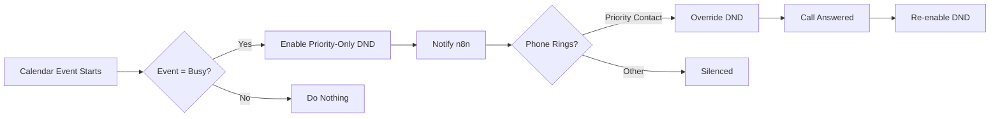

# 🔕 Auto-DND God Mode — Tasker Profile

> Calendar-aware Do Not Disturb that silences your Pixel 8 during meetings
> while letting **NEXUS priority senders** always ring through.

---

## Tasker Profile Setup

### Profile 1: Calendar DND Activator

```text
Profile: Calendar DND God Mode
  State: Calendar Entry [
    Calendar: Primary Google Calendar
    Title: *  (any event)
    Available: No  (only "Busy" events)
  ]
  
Enter Task: Enable God DND
  A1: Do Not Disturb [
    Mode: Priority Only
    Callers: Starred Contacts
    Repeat Callers: On
    Messages: Starred Contacts
  ]
  
  A2: Notification [
    Title: 🔕 NEXUS DND
    Text: Auto-DND activado: %CALTITLE
    Icon: mdi:bell-off
    Priority: Low
  ]
  
  A3: HTTP Request [
    Method: POST
    URL: http://n8n.local:5678/webhook/nexus-dnd
    Headers: Content-Type:application/json
    Body: {
      "event": "dnd_enabled",
      "reason": "%CALTITLE",
      "until": "%CALEND",
      "timestamp": "%TIMES"
    }
  ]

Exit Task: Disable God DND
  A1: Do Not Disturb [ Mode: Off ]
  
  A2: Notification [
    Title: 🔔 NEXUS
    Text: DND desactivado. %MISSEDCALLS llamadas perdidas.
    Priority: Default
  ]
  
  A3: HTTP Request [
    Method: POST
    URL: http://n8n.local:5678/webhook/nexus-dnd
    Body: {"event": "dnd_disabled", "timestamp": "%TIMES"}
  ]
```

---

### Profile 2: NEXUS Override (Priority Senders)

These contacts ALWAYS ring through, even during DND:

```text
Profile: NEXUS Priority Override
  Event: Phone Ringing
  Condition: %CNUM matches one of NEXUS_PRIORITY_NUMBERS
  
Task: Override DND for Priority
  A1: Do Not Disturb [ Mode: Off ]
  A2: Wait [ 300ms ]
  A3: Flash [ Text: 🌌 NEXUS Priority: %CNAME ]
  
  # Re-enable DND after call ends
  A4: Wait Until [ %PESSION !~ Call ]
  A5: Wait [ 2 Seconds ]
  A6: Do Not Disturb [
    Mode: Priority Only
    Callers: Starred Contacts
  ]
```

---

## Configuration

### Priority Contact Variable

In Tasker → Variables tab, create:

```text
%NEXUS_PRIORITY_NUMBERS = +34XXXXXXXXX/+34YYYYYYYYY/+34ZZZZZZZZZ
```

Separate numbers with `/`. These contacts override DND at all times.

### Calendar Filtering

To only activate DND for specific calendars:

```text
Calendar Entry [
  Calendar: trabajo@gmail.com   ← only work calendar
  Available: No
]
```

---

## How It Works



---

## Tips

> [!TIP]
> Add Daniela's Twilio number to NEXUS_PRIORITY_NUMBERS so voice call
> alerts from Daniela always ring through.
>
> [!NOTE]
> The DND mode `Priority Only` still allows alarms and starred contacts.
> This is the safest mode for meetings.
