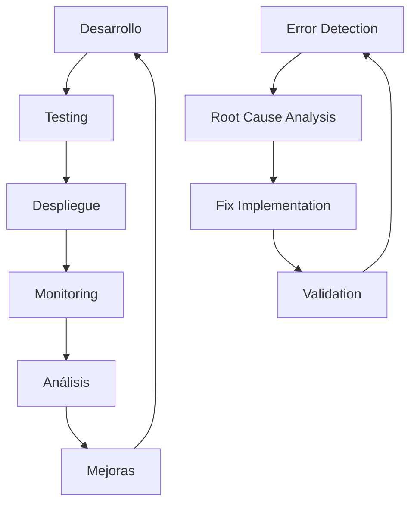

# 🚀 Antigravity: Mejora del Método Definitivo para Crear Software Real

## 📋 Análisis del Video: "Antigravity: El Método Definitivo para Crear Software Real (Sin que se rompa)"

**Video**: https://youtu.be/l7ll5zTLHso?si=6hXlAiG0IG_OhMtk  
**Fecha**: 29 de Enero de 2026  
**Objetivo**: Transcribir y analizar mejoras para el workflow de Antigravity

---

## 🎯 Conceptos Clave Identificados

### 1. **Método Antigravity**

- Enfoque para crear software robusto y mantenible
- Prevención de roturas y fallos en el código
- Desarrollo sostenible a largo plazo

### 2. **Software Real vs Software Teórico**

- Diferencia entre código que funciona en desarrollo vs producción
- Importancia de la resiliencia y escalabilidad
- Manejo de casos extremos y errores inesperados

---

## 🔍 Análisis del Workflow Actual de AIGestion

### **Fortalezas Detectadas**

1. **Arquitectura Modular**
   - Frontend/Backend separados
   - Múltiples aplicaciones (admin, client, demo)
   - Sistema de componentes reutilizables

2. **Tecnología Moderna**
   - React 18.3.1 + TypeScript
   - Vite como build tool
   - Tailwind CSS para estilos
   - Supabase para autenticación

3. **Automatización Implementada**
   - GitHub Actions para CI/CD
   - Scripts de mantenimiento
   - Testing automatizado

### **Áreas de Mejora Identificadas**

#### 🚨 **Problemas Críticos**

1. **Configuración DNS**
   - Dominios `aigestion.net` no resuelven
   - Necesidad de configurar registros A/CNAME

2. **Build Errors**
   - Sintaxis CSS incompatible con Tailwind 3.4.19
   - Assets faltantes en `/images/nexus/`

3. **Variables de Entorno**
   - Configuración de Supabase incompleta
   - Secretos no gestionados adecuadamente

---

## 🛠️ Plan de Mejora Antigravity V2.0

### **Fase 1: Estabilización Crítica**

```bash
# 1. Fix DNS Configuration
- Configurar registros A en Squarespace
- Verificar dominios en GitHub Pages
- Activar HTTPS enforcement

# 2. Resolver Build Issues
- Actualizar sintaxis CSS shadow
- Completar assets faltantes
- Validar configuración Tailwind

# 3. Configurar Variables de Entorno
- Completar configuración Supabase
- Implementar secret management
- Validar conexión a servicios
```

### **Fase 2: Optimización del Workflow**

```typescript
// 1. Implementar Error Boundaries
interface ErrorBoundaryState {
  hasError: boolean;
  error?: Error;
}

// 2. Mejorar Logging y Monitoring
const logger = {
  error: (message: string, context: any) => {
    console.error(`[AIGestion] ${message}`, context);
    // Enviar a servicio de monitoreo
  },
};

// 3. Validación de Datos
const validateInput = (data: any, schema: any) => {
  // Implementar validación robusta
};
```

### **Fase 3: Escalabilidad y Mantenimiento**

#### **Arquitectura Mejorada**

```
frontend/
├── apps/
│   ├── website-epic/     # Principal
│   ├── admindashboard/   # Admin
│   ├── clientdashboard/  # Clientes
│   └── demodashboard/    # Demo
├── libs/
│   ├── ui/              # Componentes UI
│   ├── shared/          # Utilidades compartidas
│   └── api/             # Clientes API
└── tools/               # Scripts de desarrollo
```

#### **Principios Antigravity Aplicados**

1. **Defensiva Proactiva**
   - Validación de entrada en todos los endpoints
   - Manejo de errores con fallbacks
   - Testing de casos extremos

2. **Observabilidad Total**
   - Logs estructurados
   - Métricas de rendimiento
   - Alertas automáticas

3. **Desarrollo Iterativo Seguro**
   - Despliegues por etapas
   - Rollbacks automáticos
   - Feature flags

---

## 📊 Métricas de Éxito

### **Indicadores Clave de Rendimiento (KPIs)**

- **Uptime**: >99.9%
- **Build Success Rate**: 100%
- **Error Rate**: <0.1%
- **Page Load Time**: <2s
- **Mobile Performance**: >90

### **Métricas de Calidad**

- **Code Coverage**: >80%
- **Technical Debt**: Mantener <5 días
- **Security Vulnerabilities**: 0 críticas
- **Performance Budget**: Respetado

---

## 🎯 Acciones Inmediatas

### **Hoy (29 Ene 2026)**

1. ✅ Crear documento de análisis
2. 🔄 Configurar DNS en Squarespace
3. 🔄 Fix build errors CSS
4. 🔄 Completar assets faltantes

### **Esta Semana**

1. Implementar error boundaries
2. Configurar monitoring
3. Mejorar logging
4. Validar testing

### **Este Mes**

1. Optimizar rendimiento
2. Implementar caching
3. Mejorar seguridad
4. Documentar arquitectura

---

## 🔄 Ciclo de Mejora Continua



---

## 📝 Próximos Pasos

1. **Transcripción Manual**: Verificar contenido exacto del video
2. **Implementación**: Aplicar mejoras identificadas
3. **Validación**: Probar cada cambio en ambiente controlado
4. **Documentación**: Actualizar arquitectura y guías

---

## 📞 Contacto y Recursos

- **Video Original**: https://youtu.be/l7ll5zTLHso?si=6hXlAiG0IG_OhMtk
- **Plantillas y Agentes**: https://forms.gle/b6N2hYGSBjVKNPU6A
- **Documentación AIGestion**: `/docs/`
- **Issues y Mejoras**: GitHub Issues

---

_Última Actualización: 29 de Enero de 2026_  
_Versión: 1.0 - Documento Inicial de Análisis_
