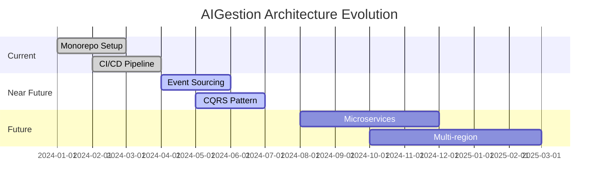

# 🏗️ AIGestion Architecture Documentation

## 📋 Table of Contents

- [System Overview](#system-overview)
- [Architecture Patterns](#architecture-patterns)
- [Component Diagram](#component-diagram)
- [Data Flow](#data-flow)
- [Technology Stack](#technology-stack)
- [Security Architecture](#security-architecture)
- [Scalability Design](#scalability-design)

---

## 🌟 System Overview

AIGestion is a **hyper-automated AI orchestration platform** built with a microservices architecture pattern.

### Core Components

```
┌─────────────────┐    ┌─────────────────┐    ┌─────────────────┐
│   Frontend UI    │    │   Backend API    │    │   AI Engine     │
│   (React/Vite)   │◄──►│   (Express/TS)   │◄──►│   (Python/Fast) │
└─────────────────┘    └─────────────────┘    └─────────────────┘
         │                       │                       │
         ▼                       ▼                       ▼
┌─────────────────┐    ┌─────────────────┐    ┌─────────────────┐
│   CDN/Static    │    │   Cache Layer   │    │   Vector DB     │
│   (Vercel)       │    │   (Redis)       │    │   (Pinecone)    │
└─────────────────┘    └─────────────────┘    └─────────────────┘
         │                       │                       │
         ▼                       ▼                       ▼
┌─────────────────┐    ┌─────────────────┐    ┌─────────────────┐
│   Load Balancer │    │   Message Queue │    │   Document DB   │
│   (Cloudflare)  │    │   (BullMQ)      │    │   (MongoDB)     │
└─────────────────┘    └─────────────────┘    └─────────────────┘
```

---

## 🏛️ Architecture Patterns

### 1. **Microservices Pattern**

- **Frontend**: React-based UI with multiple specialized apps
- **Backend**: Node.js/TypeScript API Gateway
- **AI Engine**: Python-based ML services
- **Shared Packages**: Common utilities and types

### 2. **Event-Driven Architecture**

```typescript
// Event Bus Pattern
interface EventBus {
  publish(event: DomainEvent): Promise<void>;
  subscribe(pattern: string, handler: EventHandler): void;
}

// Example Events
type UserInteractionEvent = {
  type: 'user.chat' | 'user.voice' | 'user.action';
  userId: string;
  sessionId: string;
  payload: unknown;
  timestamp: Date;
};
```

### 3. **CQRS Pattern**

```typescript
// Command Query Responsibility Segregation
interface CommandHandler<T extends Command> {
  handle(command: T): Promise<void>;
}

interface QueryHandler<T extends Query, R> {
  handle(query: T): Promise<R>;
}
```

### 4. **Repository Pattern**

```typescript
// Abstract Repository
interface Repository<T, ID> {
  findById(id: ID): Promise<T | null>;
  save(entity: T): Promise<T>;
  delete(id: ID): Promise<void>;
  find(criteria: Criteria): Promise<T[]>;
}
```

---

## 🔄 Data Flow Architecture

### Request Flow

```
1. User Request → Frontend App
2. Frontend → API Gateway (Backend)
3. API Gateway → Authentication/Authorization
4. API Gateway → Business Logic
5. Business Logic → Data Layer
6. Data Layer → Database(s)
7. Response → Reverse Flow
```

### AI Processing Flow

```
1. User Input → Frontend
2. Frontend → Backend API
3. Backend → AI Engine (Python)
4. AI Engine → Vector DB (Context)
5. AI Engine → LLM Provider (OpenAI/Anthropic)
6. AI Engine → Response Processing
7. Backend → Frontend → User
```

### Background Processing

```
1. Events → Message Queue (BullMQ)
2. Queue → Worker Processes
3. Workers → Database Operations
4. Workers → External APIs
5. Results → Event Bus
6. Event Bus → Real-time Updates
```

---

## 🛠️ Technology Stack Details

### Frontend Layer

```typescript
// Core Technologies
{
  "framework": "React 18+",
  "bundler": "Vite",
  "styling": "TailwindCSS",
  "state": "Zustand",
  "routing": "React Router",
  "testing": "Vitest + Testing Library"
}

// Apps Structure
{
  "admindashboard": "Admin interface",
  "clientdashboard": "Client portal",
  "demodashboard": "Demo showcase",
  "website-epic": "Marketing site"
}
```

### Backend Layer

```typescript
// Core Technologies
{
  "runtime": "Node.js 22+",
  "framework": "Express.js",
  "language": "TypeScript 5+",
  "di": "Inversify",
  "validation": "Zod",
  "testing": "Jest + Supertest"
}

// API Architecture
{
  "pattern": "REST + GraphQL",
  "auth": "JWT + OAuth2",
  "rateLimit": "Sliding Window",
  "caching": "Redis",
  "logging": "Winston"
}
```

### AI/ML Layer

```python
# Core Technologies
{
  "runtime": "Python 3.11+",
  "framework": "FastAPI",
  "ai": "OpenAI + Anthropic + Gemini",
  "vector": "Pinecone + Chroma",
  "processing": "LangChain + LlamaIndex"
}
```

### Data Layer

```typescript
// Primary Databases
{
  "documents": "MongoDB 7.0",
  "transactions": "PostgreSQL 15",
  "cache": "Redis 7",
  "search": "Elasticsearch",
  "analytics": "ClickHouse"
}
```

---

## 🔐 Security Architecture

### Authentication Flow

```
1. User Login → Frontend
2. Frontend → Auth Service
3. Auth Service → JWT Generation
4. JWT → API Gateway Validation
5. API Gateway → Resource Access
```

### Security Layers

```typescript
// Security Middleware Stack
interface SecurityLayers {
  authentication: 'JWT + OAuth2';
  authorization: 'RBAC + ABAC';
  rateLimit: 'Sliding Window Algorithm';
  encryption: 'AES-256 + TLS 1.3';
  audit: 'Comprehensive Logging';
  monitoring: 'Real-time Threat Detection';
}
```

### Data Protection

```typescript
// Encryption Strategy
interface DataProtection {
  atRest: 'AES-256 encryption';
  inTransit: 'TLS 1.3';
  keys: 'KMS rotation';
  pii: 'Field-level encryption';
  backup: 'Encrypted snapshots';
}
```

---

## 📈 Scalability Design

### Horizontal Scaling

```yaml
# Kubernetes Deployment Strategy
apiVersion: apps/v1
kind: Deployment
metadata:
  name: aigestion-backend
spec:
  replicas: 3
  selector:
    matchLabels:
      app: aigestion-backend
  template:
    spec:
      containers:
        - name: backend
          image: aigestion/backend:latest
          resources:
            requests:
              memory: '256Mi'
              cpu: '250m'
            limits:
              memory: '512Mi'
              cpu: '500m'
```

### Caching Strategy

```typescript
// Multi-Level Caching
interface CacheStrategy {
  level1: 'Browser Cache (1 hour)';
  level2: 'CDN Cache (24 hours)';
  level3: 'Redis Cache (15 minutes)';
  level4: 'Database Query Cache';
}
```

### Load Balancing

```typescript
// Load Balancer Configuration
interface LoadBalancerConfig {
  algorithm: 'Round Robin + Health Checks';
  stickySessions: 'User-based routing';
  failover: 'Automatic failover';
  healthChecks: 'HTTP + TCP checks';
}
```

---

## 🔧 Development Architecture

### Monorepo Structure

```
aigestion/
├── backend/              # Node.js API
├── frontend/             # React apps
│   ├── apps/            # Multiple applications
│   └── shared/          # Shared components
├── ml-service/           # Python AI services
├── packages/             # Shared libraries
├── docs/                # Documentation
├── scripts/             # Build/deploy scripts
└── infrastructure/       # IaC configurations
```

### Build System

```json
// Turbo Configuration
{
  "pipeline": {
    "build": {
      "dependsOn": ["^build"],
      "outputs": ["dist/**"]
    },
    "test": {
      "dependsOn": ["build"],
      "outputs": ["coverage/**"]
    },
    "lint": {
      "outputs": []
    }
  }
}
```

### Development Workflow

```yaml
# Git Workflow
branches:
  main: 'Production deployments'
  develop: 'Integration testing'
  feature/*: 'Feature development'
  hotfix/*: 'Emergency fixes'

# CI/CD Pipeline
stages:
  - 'lint + format'
  - 'unit tests'
  - 'integration tests'
  - 'security scan'
  - 'build'
  - 'deploy'
```

---

## 📊 Monitoring & Observability

### Metrics Collection

```typescript
// Prometheus Metrics
interface Metrics {
  http: 'Request count, latency, error rate';
  business: 'User interactions, conversions';
  system: 'CPU, memory, disk usage';
  custom: 'AI model performance';
}
```

### Logging Strategy

```typescript
// Structured Logging
interface LogStructure {
  timestamp: 'ISO 8601';
  level: 'DEBUG | INFO | WARN | ERROR';
  service: 'Service name';
  traceId: 'Request correlation';
  userId: 'User identifier';
  message: 'Log message';
  metadata: 'Contextual data';
}
```

### Alerting

```yaml
# Alert Rules
groups:
  - name: aigestion.rules
    rules:
      - alert: HighErrorRate
        expr: error_rate > 0.05
        for: 5m
        labels:
          severity: critical
        annotations:
          summary: 'High error rate detected'

      - alert: HighLatency
        expr: p95_latency > 1000
        for: 10m
        labels:
          severity: warning
```

---

## 🚀 Performance Optimization

### Frontend Optimization

```typescript
// Performance Strategies
interface FrontendOptimization {
  codeSplitting: 'Route-based + component-based';
  lazyLoading: 'Dynamic imports';
  caching: 'Service worker + HTTP cache';
  compression: 'Brotli + Gzip';
  images: 'WebP + responsive loading';
}
```

### Backend Optimization

```typescript
// Backend Performance
interface BackendOptimization {
  database: 'Connection pooling + indexing';
  caching: 'Multi-level cache strategy';
  queries: 'Query optimization + pagination';
  concurrency: 'Worker threads + async processing';
}
```

---

## 🔄 Deployment Architecture

### Environments

```yaml
environments:
  development:
    - 'Local development'
    - 'Feature branches'

  staging:
    - 'Integration testing'
    - 'Performance testing'
    - 'Security testing'

  production:
    - 'Blue-green deployment'
    - 'Canary releases'
    - 'Multi-region'
```

### Infrastructure as Code

```typescript
// Terraform Structure
interface Infrastructure {
  network: 'VPC + subnets + security groups';
  compute: 'Kubernetes cluster + auto-scaling';
  storage: 'Databases + object storage';
  monitoring: 'Prometheus + Grafana + alerting';
}
```

---

## 📚 Best Practices

### Code Quality

- ✅ **TypeScript strict mode**
- ✅ **ESLint + Prettier**
- ✅ **SonarQube quality gates**
- ✅ **Automated testing**

### Security

- ✅ **Zero-trust architecture**
- ✅ **Regular security audits**
- ✅ **Dependency scanning**
- ✅ **Penetration testing**

### Performance

- ✅ **Performance budgets**
- ✅ **Real user monitoring**
- ✅ **Load testing**
- ✅ **Database optimization**

---

## 🎯 Future Architecture Evolution

### Planned Enhancements

1. **Event Sourcing** for audit trails
2. **CQRS** for complex queries
3. **Microservices** decomposition
4. **Multi-region** deployment
5. **AI Model** optimization

### Technology Roadmap



---

## 📞 Architecture Decision Records (ADRs)

### ADR-001: Monorepo Strategy

**Status**: Accepted
**Decision**: Use pnpm workspaces with Turbo for monorepo management
**Rationale**: Simplifies dependency management and build orchestration

### ADR-002: Database Selection

**Status**: Accepted
**Decision**: MongoDB for documents, PostgreSQL for transactions
**Rationale**: Polyglot persistence for optimal performance

### ADR-003: AI Architecture

**Status**: Accepted
**Decision**: Separate Python service for AI processing
**Rationale**: Isolation of AI dependencies and optimized performance

---

_Last Updated: 2025-01-25_
_Architecture Version: 2.0.0-GOLD_
