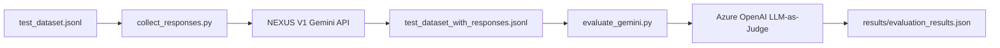

# NEXUS V1 Evaluation Framework - Setup Complete

## 📊 Qué se Implementó

Se ha agregado un **framework de evaluación completo** para la integración de Gemini API en NEXUS V1, utilizando Azure AI Evaluation SDK con evaluadores basados en LLM (LLM-as-Judge).

### Métricas Implementadas

| Métrica | Tipo | Descripción | Escala |
|---------|------|-------------|--------|
| **Coherence** | AI-assisted | Mide naturalidad y fluidez del texto | 1-5 |
| **Fluency** | AI-assisted | Evalúa corrección gramatical y sintaxis | 1-5 |
| **Relevance** | AI-assisted | Determina relevancia de la respuesta | 1-5 |

### Archivos Creados

```
evaluation/NEXUS V1/
├── README.md                    # Documentación completa del framework
├── .env.example                 # Ejemplo de configuración
├── requirements.txt             # azure-ai-evaluation, requests, python-dotenv
├── test_dataset.jsonl           # 8 consultas de prueba para Gemini API
├── collect_responses.py         # Script para colectar respuestas de /api/ai/generate
└── evaluate_gemini.py           # Script principal de evaluación con SDK
```

## 🚀 Inicio Rápido

### 1. Instalar Dependencias

```bash
cd evaluation/NEXUS V1
python -m venv venv
.\venv\Scripts\Activate.ps1  # Windows PowerShell
pip install -r requirements.txt
```

### 2. Configurar Azure OpenAI

Los evaluadores basados en LLM requieren Azure OpenAI (no Gemini):

```bash
# Copiar archivo de ejemplo
cp .env.example .env

# Editar .env con tus credenciales de Azure OpenAI
AZURE_OPENAI_ENDPOINT=https://your-resource.openai.azure.com/
AZURE_OPENAI_KEY=your-api-key-here
AZURE_OPENAI_DEPLOYMENT=gpt-4
```

> **Importante:** Azure OpenAI se usa SOLO para los evaluadores (LLM-as-Judge). Las respuestas evaluadas vienen de la API de Gemini de NEXUS V1.

> **📖 Guía completa:** Si necesitas ayuda para obtener las API keys, consulta [API_KEYS_SETUP_GUIDE.md](./API_KEYS_SETUP_GUIDE.md) para instrucciones paso a paso sobre cómo crear recursos en Azure OpenAI, obtener claves de Google Gemini y configurar MongoDB.

### 3. Colectar Respuestas de NEXUS V1

```bash
# Asegúrate de que el servidor NEXUS V1 esté corriendo
docker-compose up -d

# Colectar respuestas del endpoint /api/ai/generate
python collect_responses.py
```

Esto genera `test_dataset_with_responses.jsonl` con las respuestas de Gemini.

### 4. Ejecutar Evaluación

```bash
python evaluate_gemini.py --data test_dataset_with_responses.jsonl --output results/
```

## 📈 Resultados

Los resultados se guardan en `results/evaluation_results.json` con:

```json
{
  "metrics": {
    "coherence": 4.25,      // Promedio de coherencia
    "fluency": 4.50,        // Promedio de fluidez
    "relevance": 4.75       // Promedio de relevancia
  },
  "rows": [
    {
      "query": "¿Cuál es la capital de Francia?",
      "response": "La capital de Francia es París.",
      "coherence": 5.0,
      "coherence_reason": "Respuesta clara y directa...",
      "fluency": 5.0,
      "fluency_reason": "Gramática perfecta...",
      "relevance": 5.0,
      "relevance_reason": "Responde exactamente..."
    }
  ]
}
```

## 🔄 Workflow Completo



1. **Dataset de entrada**: `test_dataset.jsonl` contiene consultas de prueba
2. **Colección**: `collect_responses.py` llama a `/api/ai/generate` y guarda respuestas
3. **Evaluación**: `evaluate_gemini.py` usa Azure OpenAI como "juez" para evaluar respuestas
4. **Resultados**: Métricas agregadas y por fila en formato JSON

## 📚 Siguiente Paso

Para usar el framework completo, lee la documentación detallada:

```bash
cat evaluation/NEXUS V1/README.md
```

Incluye:
- Explicación detallada de cada métrica
- Ejemplos de interpretación de resultados
- Uso avanzado con datasets personalizados
- Solución de problemas comunes

## 🔗 Integración con NEXUS V1

El framework evalúa el endpoint existente:
- **Endpoint:** `POST /api/ai/generate`
- **Controlador:** `server/src/controllers/ai.controller.ts`
- **Modelo:** `gemini-pro` (Google Generative AI)

No requiere cambios en el código de NEXUS V1, solo necesita el servidor corriendo.

## 💡 Casos de Uso

1. **Benchmarking**: Comparar diferentes prompts o configuraciones
2. **Regresión**: Detectar degradación de calidad en nuevas versiones
3. **A/B Testing**: Evaluar cambios en el sistema de prompts
4. **Monitoreo**: Establecer umbrales mínimos de calidad

## 📖 Referencias

- [Documentación completa](evaluation/NEXUS V1/README.md)
- [Azure AI Evaluation SDK](https://learn.microsoft.com/en-us/azure/ai-studio/how-to/evaluate-sdk)
- [NEXUS V1 Tracing Documentation](TRACING.md)

---

**Fecha de implementación:** 2025-12-05
**Status:** ✅ Framework completo y funcional

