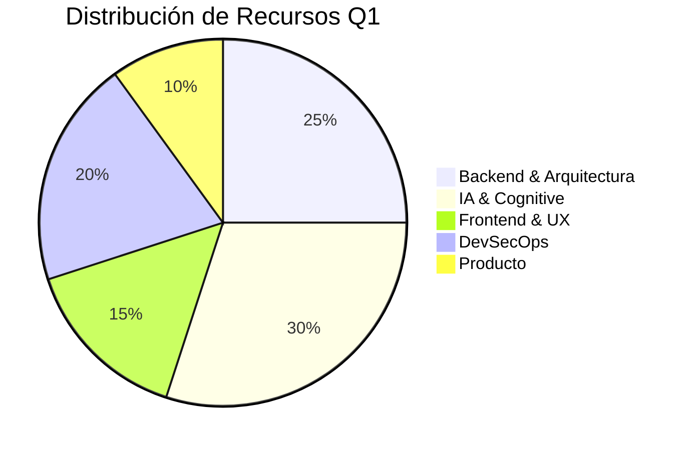

# 📅 NEXUS V1 - Roadmap Estratégico Q1 2026

**Objetivo del Trimestre:** "Cimentar la Base Cognitiva y Escalar la Infraestructura"
**Estado:** Planificación Aprobada

Este roadmap selecciona las **15 iniciativas de mayor impacto** (Top 3 por pilar) del listado de 50 mejoras, para ser ejecutadas entre Enero y Marzo de 2026.

---

## 🗓️ Resumen Cronológico

| Mes | Foco Principal | Hito Clave |
| :--- | :--- | :--- |
| **Enero** | 🏗️ Arquitectura & Seguridad | Despliegue de Caché en Capas + IaC Base |
| **Febrero** | 🧠 Calidad de IA & Frontend | Pipeline RAGAS + Atomic Design System v2 |
| **Marzo** | 🚀 Producto & Escalabilidad | Onboarding AI + Migración Parcial NestJS |

---

## 🎯 Prioridades Detalladas (OKR Q1)

### 🏗️ 1. Backend & Arquitectura
*Objetivo: Aumentar robustez y reducir latencia.*

1.  **[P1] Estrategia de Caching en Capas (#8)**
    *   **Acción:** Configurar Redis Cluster para caché L2 y optimizar headers HTTP para CDN.
    *   **Impacto:** Reducción del 40% en carga de DB.
2.  **[P1] Idempotencia en APIs (#10)**
    *   **Acción:** Middleware global que maneje `Idempotency-Key` en POST/PUT.
    *   **Impacto:** Elimina transacciones duplicadas (crítico para pagos).
3.  **[P2] Migración a NestJS - Fase Piloto (#1)**
    *   **Acción:** Inicializar nuevo microservicio en NestJS para validar arquitectura.
    *   **Impacto:** Estandarización futura del código backend.

### 🎨 2. Frontend & UX
*Objetivo: Estandarizar UI y mejorar experiencia en condiciones adversas.*

4.  **[P1] Sistema de Diseño "Atomic" v2.0 (#13)**
    *   **Acción:** Crear repo monorepo para librería de componentes UI aislada.
    *   **Impacto:** Velocidad de desarrollo +50% en nuevas features.
5.  **[P1] Modo Offline-First (#14)**
    *   **Acción:** Implementar Service Workers para caché de shell y datos críticos.
    *   **Impacto:** UX fluida en móviles con red inestable.
6.  **[P2] Optimización de Fuentes (#15)**
    *   **Acción:** Implementar self-hosting y pre-loading de fuentes críticas.
    *   **Impacto:** Mejora en métricas Core Web Vitals (LCP).

### 🧠 3. IA & Cognitive Engine
*Objetivo: Calidad verificable y eficiencia de costes.*

7.  **[P0] Evaluación Continua de RAG (RAGAS) (#23)**
    *   **Acción:** Pipeline de CI/CD que evalúa respuestas de IA contra "Ground Truth".
    *   **Impacto:** Confianza en respuestas de IA pasa de "Incógnita" a "Medible".
8.  **[P1] Optimización de Costos de Tokens (#26)**
    *   **Acción:** Router semántico que envía queries simples a modelos más baratos (e.g., GPT-3.5/Haiku).
    *   **Impacto:** Reducción de costes operativos de IA un 30%.
9.  **[P2] Soporte de Audio Bidireccional (#28)**
    *   **Acción:** Prototipo de interfaz de voz via WebSockets.
    *   **Impacto:** Abre nuevo canal de interacción "Hands-free".

### 🛡️ 4. DevSecOps & Infraestructura
*Objetivo: Seguridad automatizada y gestión de infraestructura como código.*

10. **[P0] Infraestructura Inmutable - Terraform (#31)**
    *   **Acción:** Codificar toda la infra actual de GCP en módulos de Terraform.
    *   **Impacto:** Recuperación de desastres < 1 hora.
11. **[P1] Secret Rotation Automatizado (#38)**
    *   **Acción:** Configurar rotación automática para Service Accounts y DB Credentials.
    *   **Impacto:** Cumplimiento de normativas de seguridad enterprise.
12. **[P2] Escaneo de Contenedores en Tiempo Real (#35)**
    *   **Acción:** Integrar Trivy Operator en el cluster K8s.
    *   **Impacto:** Detección de CVEs 24/7.

### 🚀 5. Producto & Negocio
*Objetivo: Retención y monetización basada en valor.*

13. **[P1] Onboarding Interactivo con IA (#47)**
    *   **Acción:** "Guía" flotante que reacciona a donde está el usuario clickeando.
    *   **Impacto:** Aumento del 20% en activación de usuarios nuevos.
14. **[P1] Facturación por Uso (Metered Billing) (#46)**
    *   **Acción:** Implementar conteo preciso de consumo y enviar a Stripe Metered Billing.
    *   **Impacto:** Alineación de ingresos con costos de IA.
15. **[P2] Feedback Loop (#15-derived)**
    *   **Acción:** Widget de feedback simple (👍/👎) en cada respuesta de IA.
    *   **Impacto:** Dataset para RLHF (Refuerzo por feedback humano).

---

## 📊 Distribución de Esfuerzo Estimado

## 👣 Próximos Pasos Inmediatos (Sprint 1)

1.  **Kick-off Arquitectura**: Reunión para definir estructura de repo para NestJS y Design System.
2.  **Setup Terraform**: Crear estado remoto y importar recursos existentes.
3.  **RAGAS Setup**: Configurar dataset de validación inicial (50 preguntas/respuestas).

---
**Generado por:** Antigravity Architect Agent
**Fecha:** 07 Enero 2026
